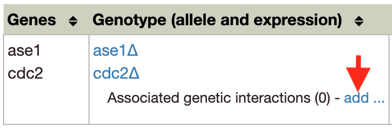
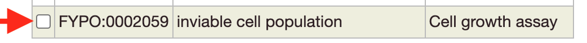

---
hide:
  - toc
---

!!! info "To add genetic interactions, you need to add phenotypes first: see [how to add phenotypes](./phenotypes.md)."

## Video summary

    

    <iframe src="https://www.youtube.com/embed/zyB7wpZypRQ" frameborder="0" allowfullscreen></iframe>
    

## Adding genetic interactions

??? warning "Do you know about all types of genetic interactions?"

    Canto supports 9 types of genetic interactions depending on the phenotypes and genotypes involved, see [PomBase genetic interaction documentation](https://www.pombase.org/documentation/genetic-and-physical-interactions).

    The language often used in publications does not match the naming of genetic interactions. For example, in publications we can find "double deletion of gene X and Y rescues the defects cellular morphology caused by deletion of gene Y". However, for BioGRID this is a phenotypic suppression not a rescue, since rescue is reserved for lethality or growth defect.

    Below is a decision making tree to determine the type of genetic interaction from the phenotypes of the single and double mutant. "Interacting allele" refers to the allele that is not present in the single mutant:

    

To start a genetic interaction annotation, you need a multi-locus phenotype that involves two genes:

  * Click `add...` in the Genotype field of an existing multi-locus phenotype annotation.
      

        
      

  * This opens a window that lets you delete existing genetic interactions, or add new ones.
  * To delete a genetic interaction, click on the red cross on the right of the annotation.
  * To create a new genetic interaction, click on `Add interaction...`.
      * Select the annotation type and click `OK`.
      * For some interactions, you will be asked to indicate the directionality
      * Then, you may be asked to link the genetic interaction to the single-locus phenotype, do so by clicking on the white box on the left of the listed annotations.
          

            
          

      * If that is the case, and you have not annotated the single locus phenotype yet, you can do it directly from the Genetic Interaction interface by clicking on `Add phenotype ...`.
