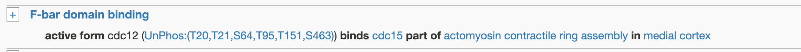
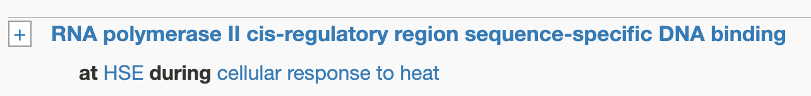

---
hide:
  - toc
---

??? warning "Before you make a GO annotation"

    * Gene Ontology (GO) annotations are used to describe the normal (wild type) functions, processes and cellular components or locations of a gene product (protein or RNA).
    * **Molecular Function** is the basic activity performed by a gene product, such as "protein serine/threonine kinase activity", "transporter" or any other activity that occurs at the molecular level. As a general rule, molecular functions correspond to single step activities performed by individual gene products. A gene can have multiple molecular functions.
    * Gene products may be annotated with multiple molecular function terms.
    * Whenever possible, we want to connect the molecular function of a gene to the other types of GO terms through annotation extensions:
        * The cellular component where that function happens (e.g. the cytoskeletal protein-membrane anchor activity of cdc12 takes place at the medial cortex).
        * The biological process in which this molecular function is involved (e.g. that cdc12 activity is involved in the mitotic actomyosin ring assembly).
            

              
            

        * The cell cycle phase during which it occurs (Cell cycle phases are also GO biological processes).
        * The cellular response to stimulus in which that molecular function is involved (e.g. hsf1 is a heat-shock transcription factor, so we can connect its "transcription regulatory region nucleic acid binding" molecular function to the "cellular response to heat")
        * GO is very rich and has many term-specific extensions. For instance, in the example below we connect the DNA binding activity of the transcription factor with HSE (Heat Shock Element, a term from the Sequence Ontology) to indicate the type of sequences where dna binding happens.
            

              
            

## Video summary

    

    <iframe src="https://www.youtube.com/embed/KY7ev8IEG00" frameborder="0" allowfullscreen></iframe>
    

## Making an annotation

* **Gene:** the gene that shows the molecular function. See [how to add genes](./genotype_management.md#adding-genes-info).
* **Term name:** a GO term describing the molecular function.
    * Start typing a molecular function in the search box. If you do not find the precise function you are looking for, choose a broad term (e.g. catalytic activity, molecular adaptor, transporter) that can be refined later.
    * Click the chosen term, and verify that the displayed definition describes the phenotype you want to annotate. There is sometimes a "Comment" section with extra tips for annotation.
    * If the blue button reads `Next`, click it and see if you can find a more specific term that the one you originally selected. If so, select it and do as before.
    * Otherwise, click `Finish`.
    * If you do not find the term you require, select a broader term, and request a new one clicking on `Suggest a new term` on the right side of the text box.
* **Annotation extension:** this field appears once you have selected a term describing the phenotype, always click the `Add` button to see if you can specify:
    * **Links to gene products:** extensions such as `anchors`, `transports`, `phosphorylates`, etc. link the molecular function of a gene with the gene products that are substrates of that activity. Some gene products should be linked to themselves (e.g. pom1 `phosphorylates` pom1)
    * **Links to biological processes:**
        * `involved in biological process` to indicate that the function takes part in a particular cellular process.
        * `happens during` to indicate that the function occurs during a cell cycle phase or cellular response to stimulus.
    * **Links to a cellular component:** `physical location` to indicate that the function occurs at a specific location or protein complex.
    * You can make several annotations with the same molecular function and gene, with different extensions:
        * To link it to several gene products (e.g. different substrates of a kinase).
        * To indicate that a gene kinase activity  phosphorylates a protein inside the nucleus during mitosis, and a different one in the cytoplasm during interphase.
    * You can find some useful biological examples in the [Before you make a GO annotation box](#).
* **Evidence code:** the type of experiment where the phenotype was observed.
* **Comment:** it's very useful for us if you indicate the figure or table where this phenotype comes from.
