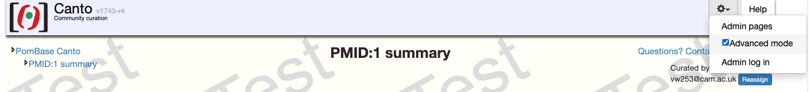

---
hide:
  - toc
---

# Canto tutorial

This site contains a step-by-step video and text guide for curating a paper using Canto. If you have received a link to curate a publication, follow the instructions below. If you want to curate a paper, but have not received a link, see [this page](./request_curation_session.md).

## Getting started

* Click on the email you have received, this should open Canto in your browser.
* Click on `Start curating`.
* You will be required to log in. Enter your information and click `Continue`.
* In the next page, you can add the list of genes that are mentioned in the paper and that you will be using for annotations later.
    * You can add multiple genes separated by any spacer (space, commas, line breaks).
    * You can refer to genes by their systematic id (SPAC3G9.12), primary name (peg1) or a synonym (cls1).
    * If a gene name is also the synonym of another gene (e.g. psu1), you will be asked to provide a primary name for that gene.
    * You can add genes later, so no need to include an exhaustive list at this point.
* You will then be asked to double-check the list of genes, and then you can proceed to curating your paper.
* The tutorials in this page use Canto advanced mode, it can be activated as shown below:

    

## Creating annotations

Depending on the publication, you may be able to add different types of annotations (we recommend this order). Follow the links below to see videos and text showing how to do it:

* [Genotypes](./genotype_management.md)
* [Phenotypes](./phenotypes.md)
* [Genetic interaction](./genetic_interaction.md): rescues, synthetic lethality, etc.
* [Physical interaction](./physical_interaction.md): for protein and RNA molecules.
* [Protein modification](./protein_modification.md): phosphorylations, palmitoylation, etc.
* [Protein sequence feature or motif](./protein_sequence_feature.md): residue range where a certain sequence feature is present (e.g. signal peptide).
* [Wild-type RNA or protein levels](./rna_protein_level.md): gene expression during a cell cycle phase, response to stimulus (e.g. heat response) or in presence of a drug.
* Gene Ontology:
    * [Molecular Function](./go_MF.md): single-step activities such as `kinase activity` or `transporter activity`.
    * [Biological Process](./go_BP.md): a series of functions with a common goal such as `MAPK cascade` or `cytokinesis`.
    * [Cellular Component](./go_CC.md): location where the gene product can be found, and what complexes it is part of, for instance `nucleus` or `fatty acid synthase complex`.

## Other useful links

* [Productivity](./productivity.md): save time in sessions with a lot of annotations.

## Funding

This work was funded by the [ELIXIR-UK: FAIR Data Stewardship](https://fellowship.elixiruknode.org/) training UKRI award (MR/V038966/1).

    
    
    

