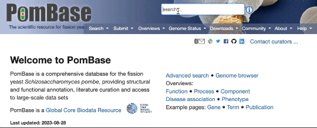

---
hide:
  - toc
---

If you have not received a link from the PomBase team to curate a publication, you can easily send a request and we will send you an email with a link shortly:

* If the publication is in PubMed, you can search for it in the PomBase search bar, and request to curate that publication (see animation below).
* If the publication is not in PomBase, send an email to [helpdesk@pombase.org](mailto:helpdesk@pombase.org) indicating the title of the publication you want to curate.

